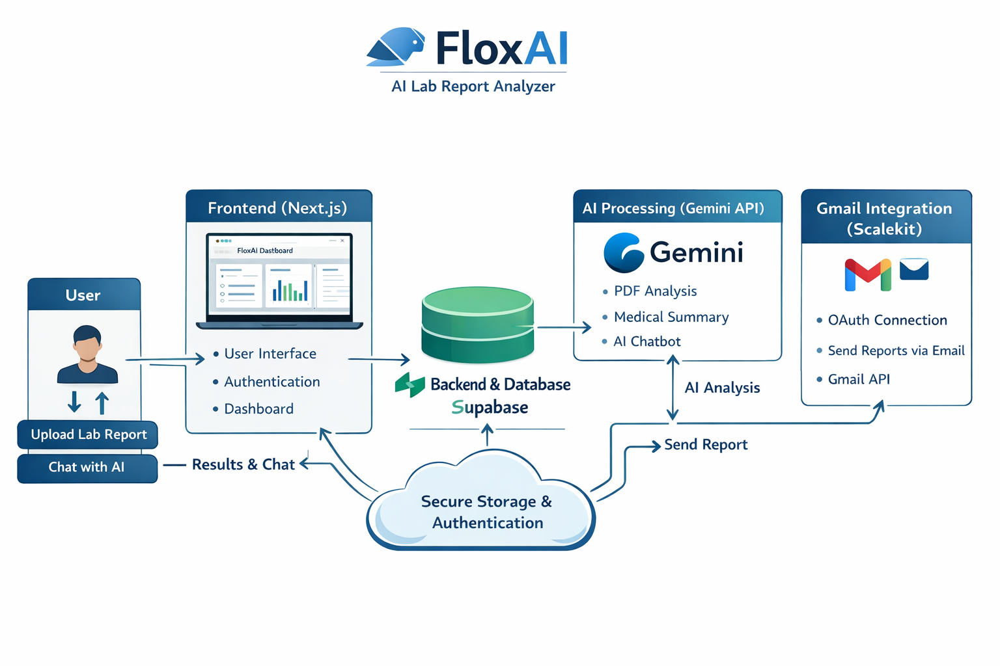

# 🚀 FloxAI – AI Lab Report Analyzer


**FloxAI** is an AI-powered web application that analyzes medical lab reports, explains results in simple language, and allows users to interact with their data through an intelligent chatbot.

🔗 **Live App:** https://floxai.bytasker.com  
📦 **Repository:** https://github.com/AhmadAlabrash/FloxAI  




---

## ✨ Features

- 📄 Upload and analyze lab reports (PDF)
- 🤖 AI-powered interpretation using Gemini
- 💬 Chat with your lab report (follow-up questions)
- 🧠 Smart summaries for patients (non-technical explanations)
- 📝 Personal notes system (track your health journey)
- 🔐 Secure authentication (Google + Email)
- 📧 Gmail integration for sending reports (via Scalekit)
- 📊 Dashboard with report insights

---


## 🎥 Demo Video

Watch how FloxAI analyzes lab reports using AI:

[](https://youtu.be/3LOTmh1DfK0)


## 🧱 Tech Stack

### ⚛️ Frontend
- Next.js – App Router, server actions, modern React architecture
- React – UI components
- Tailwind CSS – Styling and responsive design

---

### 🗄️ Backend & Database
- Supabase
  - Authentication (Google + Email)
  - PostgreSQL database
  - Row Level Security (RLS)
  - Storage for lab reports & notes

---

### 🤖 AI Integration
- Google Gemini API
  - PDF parsing & understanding
  - Medical report summarization
  - AI chatbot for follow-up questions
  - Context-aware responses

---

### 🔗 Integrations
- Scalekit
  - Gmail connection via OAuth
  - Send analyzed lab reports to users via email
  - Handles authentication flow and API complexity

---

### ☁️ Deployment
- Vercel
  - Hosting & CI/CD
  - Automatic deployments from GitHub
  - Environment variable management

---

## 🧠 How It Works

1. User uploads a **lab report (PDF)**
2. The file is sent to the backend API
3. The backend:
   - Converts PDF → text
   - Sends it to Gemini AI
4. Gemini:
   - Extracts key data
   - Identifies abnormal values
   - Generates a patient-friendly explanation
5. Results are:
   - Stored in Supabase
   - Displayed on dashboard
6. User can:
   - Ask follow-up questions (AI Chat)
   - Save notes
   - Send report via email (Scalekit Gmail)

---

## 🔐 Authentication Flow

- Powered by Supabase Auth
- Supports:
  - Email/password
  - Google OAuth
- Session handling:
  - Persistent sessions
  - Secure token-based API access

---

## 📧 Gmail Integration (Scalekit)

FloxAI uses Scalekit to simplify Gmail integration:

- Handles OAuth flow securely
- Connects user Gmail account
- Enables sending AI-generated reports via email

---


## ⚙️ Environment Variables

Create a `.env.local` file:

```env
NEXT_PUBLIC_SUPABASE_URL=
NEXT_PUBLIC_SUPABASE_ANON_KEY=
NEXT_PUBLIC_APP_URL=

GEMINI_API_KEY=

SCALEKIT_ENV_URL=
SCALEKIT_CLIENT_ID=
SCALEKIT_CLIENT_SECRET=
SCALEKIT_GMAIL_CONNECTOR_ID=gmail
```

---

## 🛠️ Getting Started

### 1. Clone the repo
```bash
git clone https://github.com/AhmadAlabrash/FloxAI.git
cd FloxAI
```

### 2. Install dependencies
```bash
npm install
```

### 3. Setup environment variables
Create `.env.local` and fill in required values.

### 4. Run the app
```bash
npm run dev
```

### 5. Open in browser
```
http://localhost:3000
```

---

## 🧪 Future Improvements

- 🔍 Better medical entity extraction
- 📊 Charts & visual insights
- 🧬 Support for more report formats
- 📱 Mobile app version
- 🧠 Fine-tuned medical AI model
- 🔐 End-to-end encryption for notes

---

## ⚠️ Disclaimer

> FloxAI is not a medical diagnostic tool.  
> Always consult a qualified healthcare professional for medical advice.

---

## 🙌 Acknowledgments

- Inspired by real-world AI healthcare use cases
- Built with modern AI + fullstack tools
- Designed to help users better understand their health data
